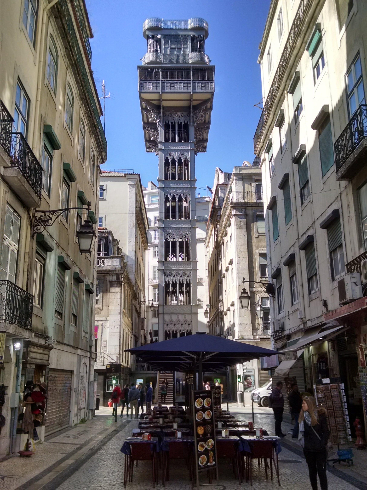
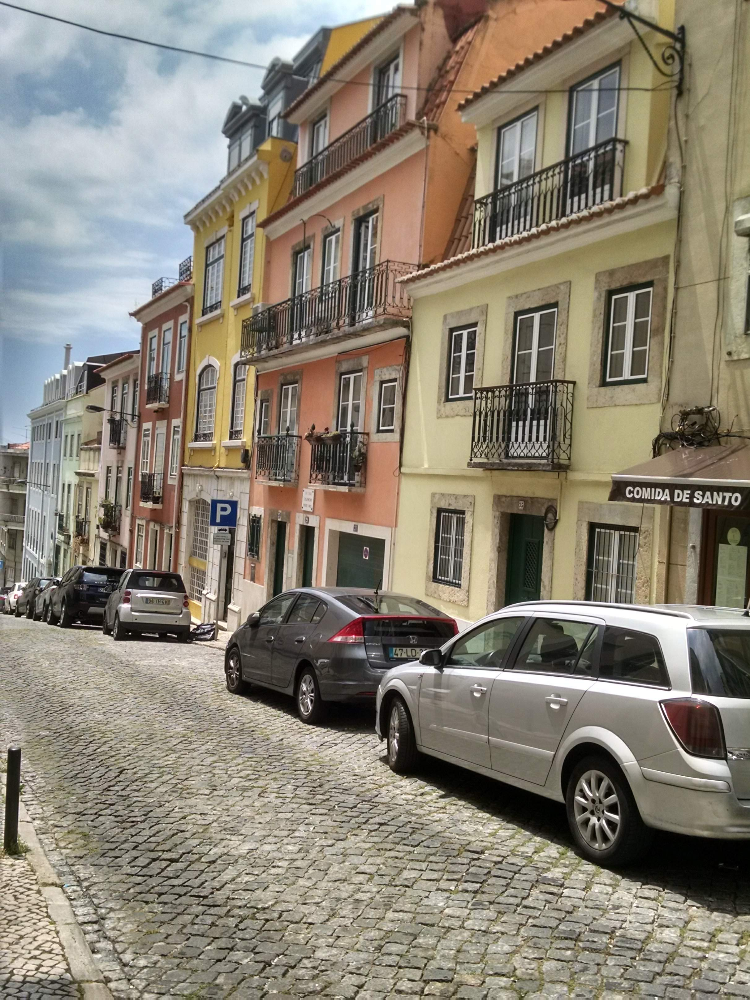
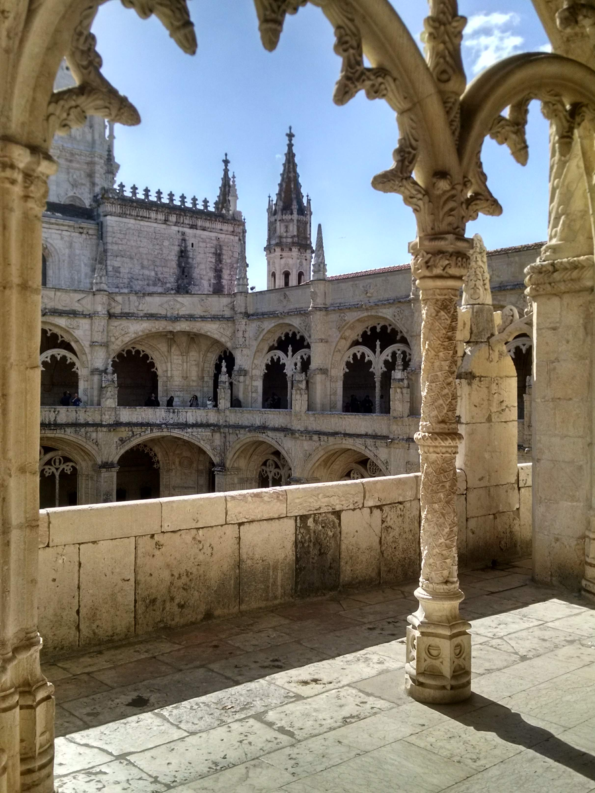

> This is my first post on my blog! How exciting!
> That post is more about sharing my last experience living in **Portugal**. I hope can 
> give you guys some useful information. It is based on my own experience.
> I lived from January 2018 to November 2018. The information in this blog might be useful.  
> 
> **The job** I have got a job via web site such as [indeed](https://indeed.com) and [linkedin](https://linkedin.com).
>  The interviews were done via skype.
> **The accomodation** I used to lived 
> in a student house and Hostel. The student accommodation was in the Alameda area and I found it via 
>[Uniplaces](https://www.uniplaces.com) that neighborhood has all amenities that you might need such as restaurants, 
> supermarket, train station, gym and so on.
> The hostel neighborhood was nearby Marques de Pombal and it was booked via [Booking.com](https://www.booking.com). 
> Everything included the hot spots was within walking distance.    
**The cost of life** The accommodation was about 450 euros for a student private room(monthly). 
> The Hostel was about 300 euros(monthly). The gym [Fitness Hut](http://www.fitnesshut.pt/clubes/lisboa/almirante-reis/) was about 7,60 euros per week. The mobile chip was Vodafone pre-paid, which the monthly cost was about 10 euros with 3 GB.
> Additionally, I used to get a subway to work, so that I got a VIVA card, which is 
> basically [public transportation card](https://www.portalviva.pt/lx/pt/homepage/cart%C3%B5es/transportes/lisboa-viva.aspx).
> Monthly, I used to spend about 37 euros to ride in Lisbon center city. The food was not 
> expensive at all. Groceries were affordable such as pasta 5 kg + sauce + ground beef = total was less than 5 euros.
> Alcoholic drinks are cheap as well such as a bottle of Portuguese wine for less than 4 euros. 
> The Lindl and Continente supermarket was my choice for shopping because these were close to my accommodation. 
> **The taxes** I was working as a [freelancer](https://www.lisbob.net/en/blog/freelancer-how-to-fill-and-issue-a-recibo-verde-in-portugal-step-by-step). Basically, I used to pay IRS and IVA.
>  
> **Conclusion** I chose to live in the center areas because of the facilities that I have mentioned in this article. Bear in mind 
that the areas that are a bit far from the center tends to be cheap. 

