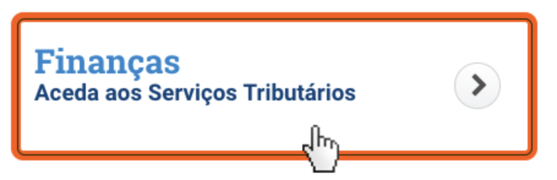
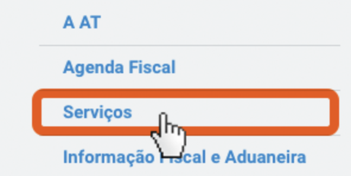
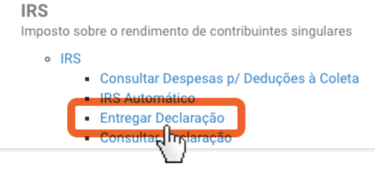
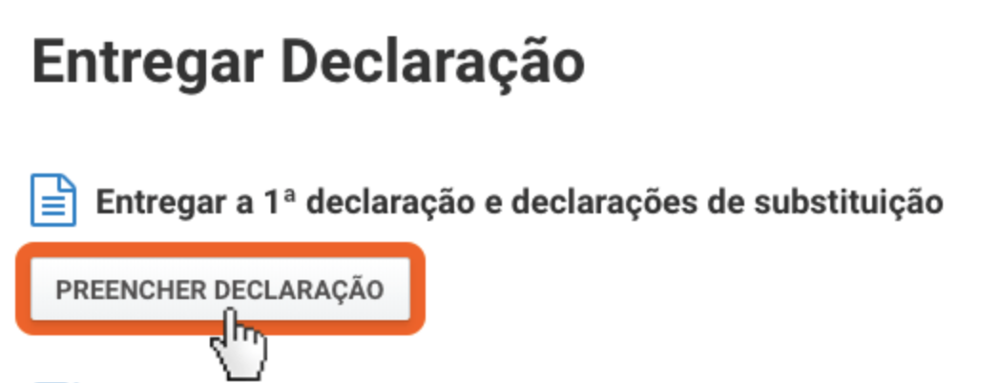
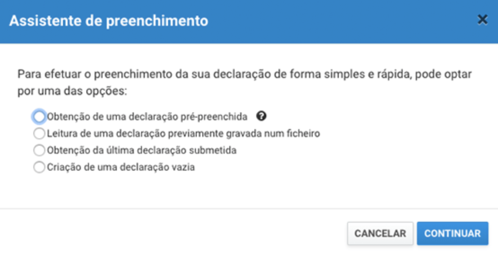
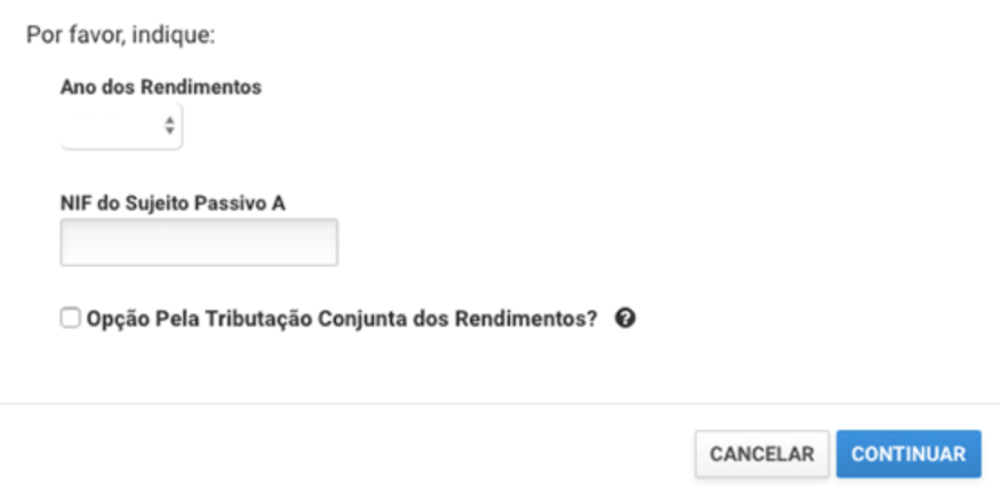
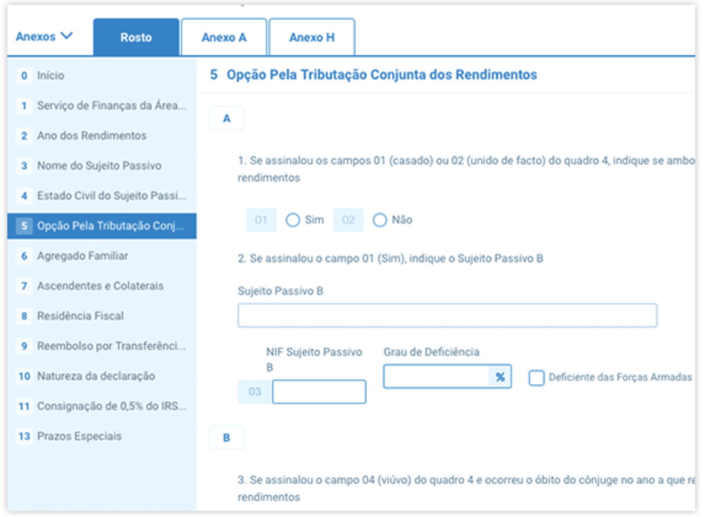

> Spoiler alert those information are based on my experience. 
> Annually, the IRS has to be declared, so that I felt a bit struggle about that because I did no get any helpful orientation from
> my employer. 
> I will outline some of the steps to get it done.

Firstly, it began in April and ended in June, 2019. It meant the period to be able to get my 2018 IRS declaration done. 

Secondly, login [Portal das Finanças](https://www.portaldasfinancas.gov.pt) 

Thirdly, Click in "Finanças" as it is shown in the image below
 

Fourthly, Click in "Serviços" as it is shown in the image below

Fifthly, Click in "Entregar Declaração" as it is shown in the image below

Sixthly, Click in "Preencher declaração" as it is shown in the image below

Seventhly, Click in "Obtenção de uma declaração pré-prenchida" as it is shown in the image below

Eighthly, select the year in my case 2018 and type the NIF as it is shown in the image below

Ninthly, it is noticeable that there are 3 Tabs by default which is "Rosto", "Anexo A" and "Anexo H" as it is shown in the 
image below. Basically, I have filled up with my data and click in "Gravar", "Simular"(that step will show if there is an error) and then "Entregar".  

I hope it gives a basic sense of direction on how to get it done. I did not have a wife or anyone, who was as my dependent. 

For further information I recommend the official [website](https://www.portaldasfinancas.gov.pt/at/html/index.html) 

