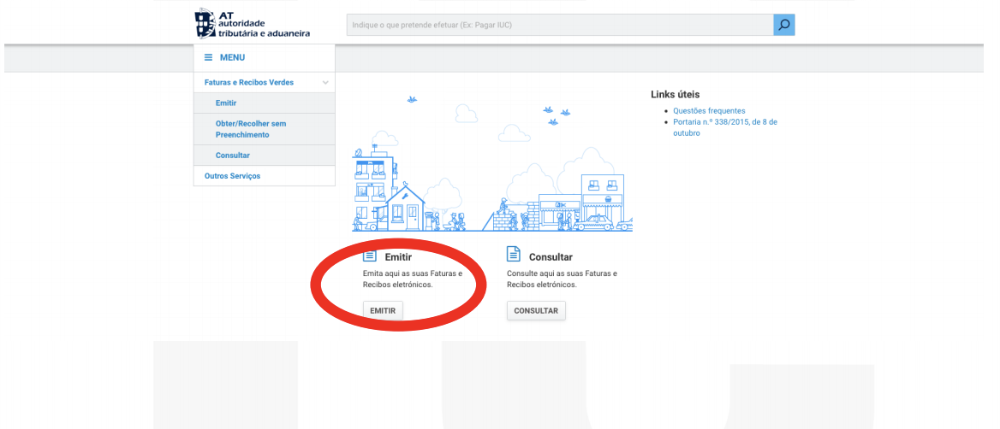
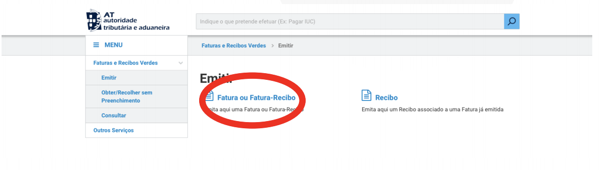
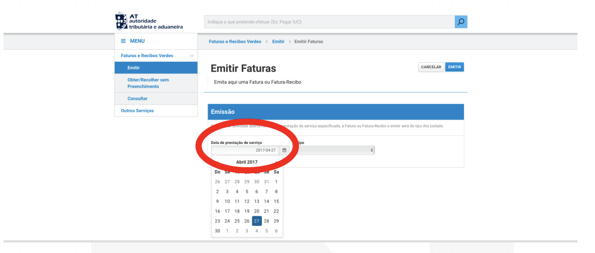
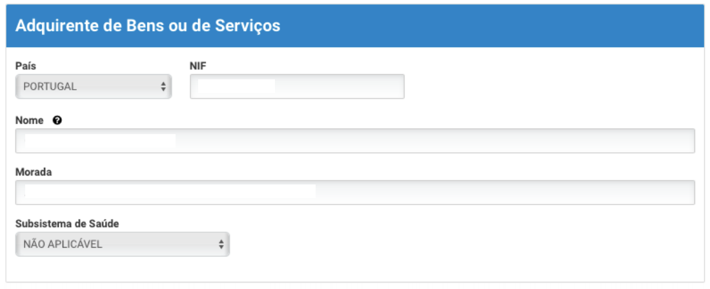
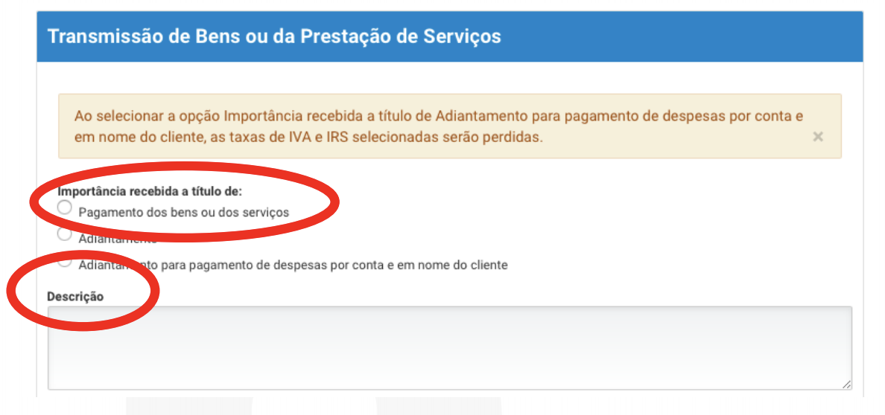
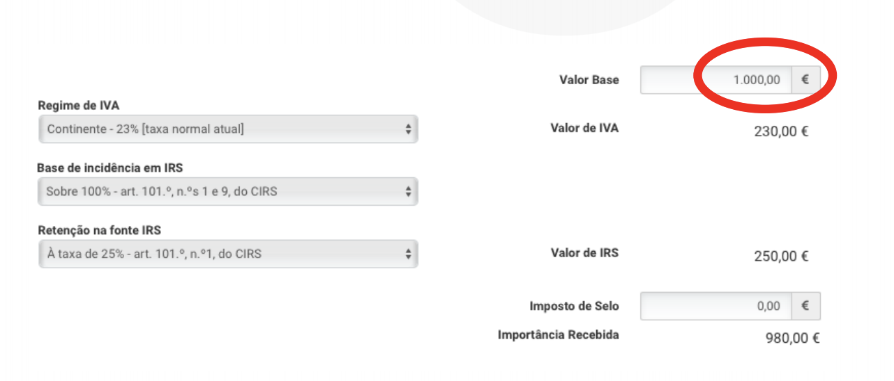

> > How to issue an invoice as know in Portugal "Recibos verdes". 
> > That is based on my experience as a non European citizenship, who was living in Portugal, 2018 

**Important:** I assume that the NIF and the registration as a freelancer has already been done.

## Step 1: Login in the website 

-There is a [Portal](https://www.portaldasfinancas.gov.pt/at/html/index.html), 
which the taxes and anual declaration can be done. Login in that website. 

## Step 2: Click in the button "Emitir" as it is shown in the image below

## Step 3: Click in the button "Fatura ou Fatura-Recibo" as it is shown in the image below

## Step 4: It is to be filled with the current date if the date that the invoice corresponds the month of you have been working".

## Step 5: It is time to fill up with the customer data in my case it was a Consulting Company, which will receive that invoice as it is shown in the image below.

## Step 6: It is to select the option "pagamento dos bens ou dos serviços" and it is recommended that a brief description to be written in the field that is shown in the image below

## Step 7: There is a practical example that is shown in the image below how I used to fill up the different taxes combination available. The example is with 1000 euros to make easy to understand how it is calculated. 

Disclaimer that is just an example.   

